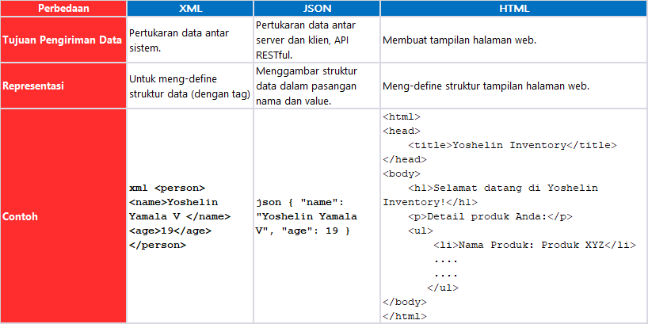

# Welcome to Yoshelin Inventory
Generated by...

Nama    :   Yoshelin Yamala Vijnana

Kelas   :   PBP B

NPM     :   2206826702

Tautan repository Adaptable: (already disabled...)


Tugas 2: [https://github.com/yoshelinn/yoshe.business#-tugas-2-pbp-]
Tugas 3: [https://github.com/yoshelinn/yoshe.business#-tugas-3-pbp-]
Tugas 4: [https://github.com/yoshelinn/yoshe.business#-tugas-4-pbp-]
Tugas 5: [https://github.com/yoshelinn/yoshe.business#-tugas-5-pbp-]
Tugas 6: [https://github.com/yoshelinn/yoshe.business#-tugas-6-pbp-]


# ===========================
# ₊✧ Tugas 2 PBP ₊✧
# ===========================
# Implementasi Checklist Step by Step

# 1.  Checklist 1:  Membuat sebuah proyek Django baru.
Django adalah sebuah framework website yang bersifat open source dalam Python yang tujuannya untuk web developing secara efisien dan aman.

- Untuk membuat proyek Django baru, step pertama yang perlu dilakukan adalah mengaktifkan virtual environment. Pengaktifan virtual environment dapat dilakukan dengan cara memasukkan perintah ini pada terminal:
  
            `python -m venv env`

- Kemudian, untuk memunculkan (env) pada terminal, kita perlu memasukkan: 

            `env\Scripts\activate.bat`


pada command prompt, kemunculan (env) menjadi tanda bahwa virtual environment sudah aktif.

pada command prompt, kemunculan (env) menjadi tanda bahwa virtual environment sudah aktif.

- Langkah selanjutnya yang perlu dilakukan ialah menyiapkan dependencies. Dependencies dapat memastikan bahwa program atau proyek tertentu dapat berjalan tanpa kesalahan. Di dalam direktori, saya membuat `requirements.txt`` yang berisi:

  ```python
        python
        django
        gunicorn
        whitenoise
        psycopg2-binary
        requests
        urllib3 
        

   ```

- Dependencies kemudian di install dengan menjalankan perintah ini pada terminal:

            `pip install -r requirements.txt`
        
 - Kemudian saya membuat proyek Django baru dengan nama `mysite` dengan menjalankan perintah berikut:

            `pip install django`

            `django-admin startproject mysite`

- Pada settings.py, kita perlu menambahkan `"*"` pada `ALLOWED_HOST` untuk mengubah pengaturan akses.
- Menambahkan berkas `.gitignore`
- Tambahkan `'main'`` ke INSTALLED_APPS di settings.py
- Cek apakah Django telah berhasil dibuat, dengan cara memasukkan perintah berikut pada direktori:

            `python manage.py runserver`

 kemudian klik tautan <http://localhost:8000> pada peramban anda.

# 2. Checklist 2: Membuat aplikasi dengan nama main pada proyek tersebut.
- Buatlah main didalam project yoshe.business menggunakan manage.py menggunakan perintah 
        
        `python manage.py startapp main`

- Ketika berhasil dijalankan, main akan terbentuk dalam direktori. Selanjutnya kita perlu add folder `templates` yang berisi `main.html`
- Kemudian kita tambahkan `main` ke INSTALLED_APPS di settings.py
  
    
# 3. Checklist 3: Melakukan routing pada proyek agar dapat menjalankan aplikasi main.
 - Pertama tama, kita perlu setup `urls.py` di app `main` dengan mengisi

 
```python
        from django.urls import path
        from main.views import show_main
        app_name = 'main'

        urlpatterns = [
            path('', show_main, name='show_main'),
        ]
```


- Tambahkan rute URL seperti berikut untuk mengarahkan ke tampilan main
     
  ```python
             urlpatterns = [
            ...
            path('main/', include('main.urls')),
            ...
          ] 
  ```
     
# 4. Checklist 4: Membuat model pada aplikasi main dengan nama `Item`` dan memiliki atribut wajib
- Melakukan setup pada `item` sesuai dengan ketentuan soal, pada atribut `nama, amount, date_added, price, description`
- Selanjutnya lakukan run 
            
            `./manage.py makemigrations` 
            
     dan 

            `./manage.py migrate` 
            
     untuk me-migrasikan ke database.

# 5. Checklist 5:  Membuat sebuah routing pada urls.py aplikasi main untuk memetakan fungsi yang telah dibuat pada views.py
- Setup views.py dengan melakukan inisiasi data yang akan dipanggil pada main, kemudian buat juga render html nya sebagai berikut:

            `render(request, "main.html", context)` 

- Pada main, kita lakukan `include` pada root project, yakni file `urls.py`

# 6. Checklist 6: Melakukan deployment ke Adaptable terhadap aplikasi yang sudah dibuat sehingga nantinya dapat diakses oleh teman-temanmu melalui Internet.
- Lakukan `add, commit, dan push` ke GitHub dan lakukan deployment pada platform Adaptable sesuai dengan perintah yang tersedia pada Tutorial 0 PBP.


# Bagan yang berisi request client ke web aplikasi berbasis Django
 

=======


 - Keterkaitan antara urls.py dan views.py adalah bahwa urls.py berfungsi untuk menguraikan argumen dari URL dan meneruskannya ke views.py yang sesuai. Setelah itu, views.py akan mengambil permintaan tersebut dan menghasilkan respons web yang sesuai.

 - Hubungan antara views.py dan berkas HTML adalah bahwa views.py akan mengambil template dari berkas HTML. Selanjutnya, template tersebut akan digabungkan dan diproses oleh views.py sehingga menghasilkan halaman web yang lengkap.

 - Kaitan antara views.py dan models.py terletak pada fakta bahwa models.py akan mengambil data dari database dan mengirimkannya ke views.py.

- Secara keseluruhan, urls.py berfungsi untuk mengelola argumen yang diterima dari pengguna dan mengarahkannya ke berkas HTML yang berisi template web. Berkas HTML tersebut akan menghasilkan outputnya melalui views.py. Ketika ada permintaan untuk mengambil data, models.py berperan sebagai perantara yang menghubungkan views.py dengan database. Dengan demikian, views.py dapat menggabungkan dan memproses data tersebut untuk menciptakan halaman web yang utuh.


# Jelaskan mengapa kita menggunakan virtual environment? Apakah kita tetap dapat membuat aplikasi web berbasis Django tanpa menggunakan virtual environment?

 - Virtual Environment (VE) adalah alat yang membantu pengembang perangkat lunak mengisolasi proyek mereka dari yang lain, sehingga setiap proyek dapat memiliki dependensi yang berbeda tanpa saling mengganggu. Hal ini memungkinkan penggunaan versi yang berbeda dari modul yang sama dalam setiap proyek, dan VE memiliki beberapa manfaat penting:
        1. Isolasi Dependensi: VE memungkinkan proyek-proyek berbeda untuk memiliki dependensi yang berbeda, seperti versi modul yang berbeda, tanpa konflik.
        2. Manajemen Dependensi yang Jelas: VE membantu mengelola dan menjaga daftar dependensi yang jelas untuk setiap proyek, menghindari kebingungan dan penghapusan yang tidak sengaja.
        3. Menghindari Konflik Dependensi: VE mencegah konflik antara dependensi yang berbeda, memastikan bahwa proyek-proyek berjalan dengan lancar.

- Meskipun memungkinkan dengan tidak menggunakan VE, disarankan untuk menggunakan lingkungan virtual saat membuat aplikasi web berbasis Django. Hal ini bertujuan agar versi perpustakaan (library) yang digunakan dalam satu proyek tidak terpengaruh jika kita melakukan pembaruan pada perpustakaan yang sama dalam proyek lainnya.


# Jelaskan apakah itu MVC, MVT, MVVM dan perbedaan dari ketiganya.
Model-View-Controller (MVC), Model-View-Template (MVT), dan Model-View-ViewModel (MVVM) adalah arsitektur desain perangkat lunak yang digunakan dalam pengembangan aplikasi. 

- MVC (Model-View-Controller):
Model: Mengelola data dan logika bisnis aplikasi. Ini berinteraksi dengan database dan mengambil, memodifikasi, atau menyimpan data.
        View: Bertanggung jawab untuk menampilkan data kepada pengguna dalam bentuk yang sesuai. Ini tidak berisi logika bisnis tetapi hanya menampilkan informasi.
        Controller: Bertindak sebagai perantara antara Model dan View. Ini mengontrol alur aplikasi, mengelola permintaan pengguna, dan mengatur interaksi antara Model dan View. Ini juga menangani routing dan pengolahan permintaan.

- MVT (Model-View-Template):
Model: Mirip dengan MVC, Model mengelola data dan logika bisnis. Ini berhubungan dengan database dan operasi data lainnya.
        View: View dalam MVT adalah logika yang mengatur cara tampilan akan ditampilkan kepada pengguna, mirip dengan template dalam MVC.
        Template: Bertanggung jawab untuk rendering tampilan yang disesuaikan dengan data yang diberikan oleh View. Template ini menentukan cara tampilan akhir akan muncul.

-  MVVM (Model-View-ViewModel):
Model: Seperti dalam MVC dan MVT, Model mengelola data dan logika bisnis aplikasi.
        View: Bertanggung jawab untuk menampilkan data dan interaksi dengan pengguna seperti dalam MVC.
        ViewModel: Ini adalah bagian yang paling khas dari MVVM. ViewModel menghubungkan Model dan View. Ini menangani logika tampilan dan transformasi data sehingga dapat ditampilkan dengan benar di View. ViewModel berperan sebagai perantara antara Model dan View.

- Perbedaan utama antara ketiganya adalah:
1. Template vs. View vs. Controller/ViewModel: MVC memiliki View, MVT memiliki Template, dan MVVM memiliki View dan ViewModel. MVVM memiliki ViewModel tambahan yang mengelola logika tampilan.
2. Penanganan Logika Tampilan: MVC dan MVT memiliki logika tampilan dalam Controller dan Template masing-masing, sementara MVVM memisahkan logika tampilan ke dalam ViewModel yang terpisah.
3. Struktur Pengembangan: Struktur MVC lebih berfokus pada kontrol alur aplikasi, sedangkan MVT lebih berfokus pada tampilan yang dihasilkan dari Template. MVVM menambahkan abstraksi tambahan untuk mengelola tampilan dengan baik.


# ===========================
# ₊✧ Tugas 3 PBP ₊✧
# ===========================

# 1. Checklist 1: Apa perbedaan antara form POST dan form GET dalam Django?
Dalam Django, kita dapat menggunakan metode POST dan GET untuk mengirim data dari formulir HTML ke server web Django.

- Aspek Delivery Data
Dalam form POST, input data yang dimasukkan ke form akan dikirim ke dalam server web sebagai body request dari HTTP. Data bersifat invisible. 

Dalam form GET, data yang dikirim ke form merupakan bagian dari URL sehingga data terlihat dalam alamat website. Data bersifat visible.

- Aspek Security
Form POST lebih aman karena data yang di-deliver tidak terlihat dalam URL, sehingga tidak mudah terpapar ke publik,

Form GET tingkat keamanannya lebih rendah dari form POST karena data nya bersifat visible, maka data dapat dilihat oleh pengguna lain.

- Aspek Kapasitas
Form POST memiliki batasan ukuran data yang dapat di-deliver lebih besar dibandingkan degan form GET.

 
# Checklist 2: Apa perbedaan utama antara XML, JSON, dan HTML dalam konteks pengiriman data?


# Checklist 3: Mengapa JSON sering digunakan dalam pertukaran data antara aplikasi web modern?
1. Format JSON readable sehingga mudah dimengerti
2. Compatible dengan banyak bahasa pemrograman
3. Format data yang digunakan JSON merupakan format data umum dalam API, untuk mengirim permintaan dan menerima respons.
4. Pertukaran data antar server dan klien aman

# Checklist 3: Jelaskan bagaimana cara kamu mengimplementasikan checklist di atas secara step-by-step 

1. Membuat input form untuk menambahkan objek model pada app sebelumnya.
- Pertama tama, buat `base.html` pada template yang ada di root
```html

<!DOCTYPE html>
<html lang="en">
    <head>
        <meta charset="UTF-8" />
        <meta
            name="viewport"
            content="width=device-width, initial-scale=1.0"
        />
        
        
    </head>

    <body>
        
        
    </body>
</html>
```

- Kemudian, kita add `settings.py` dengan kode agar base.html dapat dideteksi sebagai templates
```python
TEMPLATES = [
    {
        'BACKEND': 'django.template.backends.django.DjangoTemplates',
        'DIRS': [BASE_DIR / 'templates'], # Tambahkan kode ini
        'APP_DIRS': True,
        ...
    }
 
]
```

- Pada `forms.py` kita mengimpor `ModelForm` dan Item yang berisi fields, yang bertujuan untuk menambah item ke database dengan `ModelForm`

```python
from django.forms import ModelForm
from main.models import Item

class ProductForm(ModelForm):
    class Meta:
        model = Item
        fields = ["name", "amount", "description", "price" ]
```

- Pada `templates > create_product.html`, 
berisi fungsi `create_product(request)` yang dapat mengakses file `create_product.html` untuk menerima request, membuat dan menyimpan data yang diinput pada form.
 ```python
    from django.http import HttpResponse
    from django.core import serializers
    from django.shortcuts import render
    from django.http import HttpResponseRedirect
    from main.forms import ProductForm
    from django.urls import reverse
    from main.models import Item
    from django.forms import ModelForm
    ]
```

- Pada `forms.py` kita mengimpor `ModelForm` dan Item yang berisi fields, yang bertujuan untuk menambah item ke database dengan `ModelForm`

  ```python
         from django.forms import ModelForm
         from main.models import Item

          class ProductForm(ModelForm):
           class Meta:
           model = Item
           fields = ["name", "amount", "description", "price" ]
  ```

- Pada `templates > create_product.html`, 
berisi fungsi `create_product(request)` yang dapat mengakses file `create_product.html` untuk menerima request, membuat dan menyimpan data yang diinput pada form.
 ```html
    from django.http import HttpResponse
    from django.core import serializers
    from django.shortcuts import render
    from django.http import HttpResponseRedirect
    from main.forms import ProductForm
    from django.urls import reverse
    from main.models import Item
    from django.forms import ModelForm

def show_main(request):
    items = Item.objects.all()
    item_count = items.count()

    context = {
        'name': 'Yoshelin Yamala Vijnana',
        'class': 'PBP B',
        'items': items,
        'item_count': item_count,
    }

    return render(request, "main.html", context)

def create_product(request):
    form = ProductForm(request.POST or None)

    if form.is_valid() and request.method == "POST":
        form.save()
        return HttpResponseRedirect(reverse('main:show_main'))

    context = {'form': form}
    return render(request, "create_product.html", context)
 ```


- Memodifikasi `urls.py` dengan add `create_product`
    ```python
    from main.views import *
    from django.urls import path
    from main.views import *
    app_name = 'main'
      
    urlpatterns = [
      path('', show_main, name='show_main'),
      path('create-product', create_product, name='create_product'),
      ]
    ```

 
- Dengan form yang sudah ada, maka itu dapat menjadi bekal untuk melengkapi `create_product.html` dan `main` sebagai berikut:
```html



<style>
    body {
        background-color: #abd3cc;
    }
</style>

<h1 style="color: #00a99d; font-size: 34px;">Selamat Datang di Yoshelin Inventory</h1>
<p>By: Yoshelin | PBP B | 2206826702 <p>

<hr style="border: 1px solid #00a99d ">

<p>     </p>  
<h5> Nama:  </h5>
<p>{{ name }}</p>


<h5> Kelas: </h5>
<p>{{ class }}</p>


<h5> Produk: </h5>
<p>{{ item }}</p>

<p>Kamu telah menyimpan {{ items|length }} item pada aplikasi ini.</p>

<style>
    table {
        border-collapse: collapse;
        width: 100%;
    }

    td, th {
        border: 3px solid #00a99d;
        text-align: left;
        padding: 10px;
    }

    th {
        background-color: #00a99d;
    }
</style>

<table>
    <tr>
        <th>Name</th>
        <th>Price</th>
        <th>Amount</th>
        <th>Description</th>
        <th>Date Added</th>
    </tr>
    
        <tr>
            <td>{{ item.name }}</td>
            <td>{{ item.price }}</td>
            <td>{{ item.amount }}</td>
            <td>{{ item.description }}</td>
            <td>{{ item.date_added }}</td>
        </tr>
    
</table>

<br />

<a href="">
    <button>
        Add New Item
    </button>
</a>

<style>
    h5 {
        font-size: 18px;
    }

    p {
        font-size: 16px;
    }
</style>

 

```

(Saya menambahkan tabel, garis horizontal dan pemberian warna background pada Inventory App saya.)

2.  Tambahkan 5 fungsi views untuk melihat objek yang sudah ditambahkan dalam format HTML, XML, JSON, XML by ID, dan JSON by ID.

- Untuk melihat objek dengan format tersebut, langkah pertama yang harus kita lakukan yakni dengan melakukan import di `views.py`
```python
from django.http import HttpResponse
from django.core import serializers
```

- Kemudian, kita bisa langsung menginisiasi fungsi untuk menampilkan format HTML, XML, JSON. XML by ID, dan JSON by ID. Sebagai berikut: (pada views.py)
```python
from django.http import HttpResponse
from django.core import serializers
from django.shortcuts import render
from django.http import HttpResponseRedirect
from main.forms import ProductForm
from django.urls import reverse
from main.models import Item
from django.forms import ModelForm

def show_main(request):
    items = Item.objects.all()
    item_count = items.count()

    context = {
        'name': 'Yoshelin Yamala Vijnana',
        'class': 'PBP B',
        'items': items,
        'item_count': item_count,
    }

    return render(request, "main.html", context)

def create_product(request):
    form = ProductForm(request.POST or None)

    if form.is_valid() and request.method == "POST":
        form.save()
        return HttpResponseRedirect(reverse('main:show_main'))

    context = {'form': form}
    return render(request, "create_product.html", context)

def show_xml(request):
    data = Item.objects.all()
    return HttpResponse(serializers.serialize("xml", data), content_type="application/xml")

def show_json(request):
    data = Item.objects.all()
    return HttpResponse(serializers.serialize("json", data), content_type="application/json")

def show_xml_by_id(request, id):
    data = Item.objects.filter(pk=id)
    return HttpResponse(serializers.serialize("xml", data), content_type="application/xml")

def show_json_by_id(request, id):
    data = Item.objects.filter(pk=id)
 
    return HttpResponse(serializers.serialize("json", data), content_type="application/json")
```


**3. Membuat routing URL untuk masing-masing views yang telah ditambahkan pada poin 2.**

- Import semua fungsi yang telah dibuat pada `views.py` di direktori main, kemudian tambahkan semua path sesuai dengan fungsi yang telah dibuat sebagai berikut:
```python
from django.urls import path
from main.views import *
app_name = 'main'

urlpatterns = [
    path('', show_main, name='show_main'),
    path('create-product', create_product, name='create_product'),
    path('xml/', show_xml, name='show_xml'),
    path('json/', show_json, name='show_json'),
    path('xml/<int:id>/', show_xml_by_id, name='show_xml_by_id'),
    path('json/<int:id>/', show_json_by_id, name='show_json_by_id'),
    ]
```

# Mengakses kelima URL di poin 2 menggunakan Postman
# 1. HTML


# 2. XML


# 3. JSON


# 4. XML by ID


# 5. JSON by ID


# ===========================
# ₊✧ Tugas 4 PBP ₊✧
# ===========================

# Apa itu Django UserCreationForm, dan jelaskan apa kelebihan dan kekurangannya?

UserCreationForm dalam Django adalah bagian dari sistem otentikasi pengguna built-in dari Django. Dengan menggunakan UserCreationForm, kita dapat membuat formulir pendaftaran pengguna dengan mudah.

**Kelebihan:**
- Mudah digunakan karena merupakan bagian bawaan Django.
- Terintegrasi sempurna dengan Django.
- Menyediakan validasi otomatis.

**Kekurangan:**
- Terikat pada template default Django, menyulitkan kustomisasi tampilan.
- Tidak cocok untuk form dengan kasus khusus, membatasi penggunaan template yang ada.

# Apa perbedaan antara autentikasi dan otorisasi dalam konteks Django, dan mengapa keduanya penting?
- Autentikasi adalah proses memverifikasi identitas pengguna, memastikan bahwa mereka adalah siapa yang mereka klaim menjadi saat login. 
- Otorisasi, di sisi lain, adalah langkah berikutnya yang memeriksa hak akses pengguna setelah mereka diautentikasi, menentukan apa yang dapat mereka lakukan dan akses dalam sistem berdasarkan peran atau izin yang mereka miliki.
- Keduanya merupakan aspek penting dalam keamanan website. Autentikasi memastikan hanya pengguna yang sah yang diizinkan masuk, sementara otorisasi memastikan bahwa mereka hanya dapat melakukan tindakan sesuai dengan tingkat akses yang telah ditentukan, sehingga melindungi data dan sumber daya yang sensitif dari akses yang tidak sah.

# Apa itu cookies dalam konteks aplikasi web, dan bagaimana Django menggunakan cookies untuk mengelola data sesi pengguna?

- Cookies adalah informasi yang dikirimkan dari server web ke browser dan di-return oleh browser ke server untuk digunakan di masa mendatang. Penggunaan umum cookies meliputi autentikasi, pelacakan pengguna, dan menyimpan preferensi pengguna.
- Dalam konteks Django, cookies digunakan untuk menyimpan informasi autentikasi seperti sesi atau token, yang memungkinkan pengguna tetap masuk saat menjelajahi situs web. Django memiliki fitur built-in untuk mengelola sesi pengguna, yang dapat dikonfigurasi untuk menyimpan data sesi dalam cookies. 
- Data sesi dalam cookies ini dapat berisi informasi terkait pengguna dan dapat diakses oleh server pada setiap permintaan berikutnya, memungkinkan aplikasi untuk menyimpan dan memanfaatkan informasi terkait pengguna selama sesi mereka di situs web.

# Apakah penggunaan cookies aman secara default dalam pengembangan web, atau apakah ada risiko potensial yang harus diwaspadai?

- Penggunaan cookies pada website umumnya aman, namun ada risiko yang harus diwaspadai. Penyerang dapat mencoba memanfaatkan cookies pengguna untuk melakukan tindakan yang tidak sah dalam sesi pengguna tanpa izin.

- Contohnya, jika seorang pengguna masuk ke akun mereka dan meninggalkan sesinya tanpa keluar, penyerang yang mendapatkan akses ke komputer pengguna tersebut dapat mencuri cookies yang menyimpan sesi otentikasi. Dengan cookies ini, penyerang dapat mengakses akun bank pengguna tanpa izin dan melakukan tindakan yang merugikan.

- Selain itu, penyerang juga dapat melakukan serangan Cross-Site Scripting (XSS) untuk mencuri cookies pengguna dan menjalankan tindakan jahat di situs web yang dimiliki oleh penyerang, seperti mengganti informasi pengguna atau mengambil alih akun. 

- Oleh karena itu, penting untuk selalu menjaga keamanan cookies.

# Implementasi Checklist Step by Step
1. Menambahkan import terlebih dahulu
    ```python
    from django.shortcuts import redirect
    from django.contrib.auth.forms import UserCreationForm
    from django.contrib import messages  
    ```
2. Membuat fungsi baru di `views.py` yaitu register
```python
    def register(request):
    form = UserCreationForm

    if request.method == "POST":
        form = UserCreationForm(request.POST)
        if form.is_valid():
            form.save()
            messages.success(request, 'Your account has been successfully created!')
            return redirect('main:login')
    context = {'form':form}
    return render(request, 'register.html', context)
```

3. Pada `main/templates`, kita buat file HTML berupa `register.html`
```html



    <title>Register</title>


  

<div class = "login">
    
    <h1>Register</h1>  

        <form method="POST" >  
              
            <table>  
                {{ form.as_table }}  
                <tr>  
                    <td></td>
                    <td><input type="submit" name="submit" value="Daftar"/></td>  
                </tr>  
            </table>  
        </form>

      
        <ul>   
              
                <li>{{ message }}</li>  
                  
        </ul>   
    

</div>  


```

4. Menambahkan path baru yakni `regiter` pada `urls.py`
    ```python
    from main.views import register
    urlpatterns = [
    ...
    path('register/',register,name='register'),
    ]
    ```

5. Membuat fungsi login user pada `views.py`
    ```python
    def login_user(request):
    if request.method == 'POST':
        username = request.POST.get('username')
        password = request.POST.get('password')
        user = authenticate(request, username=username, password=password)
        if user is not None:
            login(request, user)
            response = HttpResponseRedirect(reverse("main:show_main")) 
            response.set_cookie('last_login', str(datetime.datetime.now()))
            return response
        else:
                messages.info(request, 'Sorry, incorrect username or password. Please try again.')
    context = {}
    return render(request, 'login.html', context)
    ```

6. Membuat `login.html` pada templates sebagai berikut:
```html



    <title>Login</title>




<div class = "login">

    <h1>Login</h1>

    <form method="POST" action="">
        
        <table>
            <tr>
                <td>Username: </td>
                <td><input type="text" name="username" placeholder="Username" class="form-control"></td>
            </tr>
                    
            <tr>
                <td>Password: </td>
                <td><input type="password" name="password" placeholder="Password" class="form-control"></td>
            </tr>

            <tr>
                <td></td>
                <td><input class="btn login_btn" type="submit" value="Login"></td>
            </tr>
        </table>
    </form>

    
        <ul>
            
                <li>{{ message }}</li>
            
        </ul>
         
        
    Don't have an account yet? <a href="">Register Now</a>

</div>

<style>
    body {
        background-color: #00a99d; /* Ubah warna latar belakang ke tosca (#00a99d) */
    }
</style>


```

(Tidak lupa untuk menambahkan path login di urls.py nya)

7. Membuat fungsi logout pada `views.py`, dan menambahkan path nya pada `urls.py`

```python
      def logout_user(request):
          logout(request)
          response = HttpResponseRedirect(reverse('main:login'))
          response.delete_cookie('last_login')
          return response
```

8. Membuat button pada `main.html`

```html
    <a href="">
        <button type="button">
            Logout
        </button>
    </a>
```

# Menghubungkan Item dan Pengguna
1. Pada models.py, kita import user dan menambahkan atributnya
```python
from django.db import models
from django.contrib.auth.models import User

class Item(models.Model):
    user = models.ForeignKey(User, on_delete=models.CASCADE)  
```

2. Pada fungsi create_product, ubah fungsinya agar terhubung dengan user.
    ```python
    def create_product(request):
    form = ProductForm(request.POST or None)

    if form.is_valid() and request.method == "POST":
        item = form.save(commit=False)
        item.user = request.user
        item.save()
        return HttpResponseRedirect(reverse('main:show_main'))

    context = {'form': form}
    return render(request, "create_product.html", context)
    ```

3. Menambahkan filter pada `views.py`
```python
    def show_main(request):
    Items = Item.objects.filter(user=request.user)
```

4. Menampilkan detail logged in users dengan last_login pada fungsi show_main
`'last_login': request.COOKIES['last_login'], `

5. Delete cookies saat logout dan menampilkan last loginnya pada main.html
`response.delete_cookie('last_login')`

lalu menampilkannya pada main
`<h5>Sesi terakhir login: {{ last_login }}</h5>`

# ===========================
# ₊✧ Tugas 5 PBP ₊✧
# ===========================

#  Jelaskan manfaat dari setiap element selector dan kapan waktu yang tepat untuk menggunakannya.
1. Element selector
   Digunakan ketika kita ingin mengubah gaya semua elemen dengan tag yang sama di seluruh page
   ```html
   p {
    color: blue;
    }
    ```

2. Class Selector
   Digunakan ketika Anda ingin memberikan gaya atau gaya yang sama kepada beberapa elemen yang memiliki kesamaan style.
   ```html
    <p class="highlight">Ini char di-highlight.</p>
    <p>Ini adalah teks biasa.</p>
    
    .highlight {
        background-color: yellow;
    }
   ```

3. ID Selector
   Digunakan ketika Anda ingin style khusus pada satu elemen saja yang memiliki ID khusus.
   ```html
    <div id="header">Ini header</div>
    <div>Ini isi konten.</div>
    
    #header {
        font-size: 24px;
    }
   ```

# Jelaskan HTML5 Tag yang kamu ketahui.
title: Menentukan judul halaman web

head: Berisi informasi metadata dokumen, seperti judul dan link ke stylesheets

html: Mendefinisikan dokumen HTML

meta: Mendefinisikan metadata seperti karakter set dan deskripsi

div: Mengelompokkan dan merapikan elemen HTML

body: Berisi konten utama halaman website

p: Menampilkan teks dalam paragraf

a: Membuat link ke halaman web atau source

img: Menampilkan gambar di web

h1, h2, ..., h6: Mengatur heading level 1 hingga 6

br: Menambahkan line break dalam teks

hr: Menambahkan garis horizontal untuk memisahkan konten

form: Membuat formulir yang meminta input dari pengguna

input: Menambahkan kontrol input dalam forms seperti teks, password, dll

button: Membuat tombol yang dapat diklik

table: Membuat tabel dalam format terstruktur

tr: Menandai baris dalam tabel

td: Menandai sel dalam tabel.

th: Menandai header dalam tabel.

#  Jelaskan perbedaan antara margin dan padding.

- Margin adalah ruang kosong di sekitar elemen HTML, yang mengatur jarak antara elemen tersebut dan elemen-elemen lain atau tepi page browser. argin digunakan untuk mengatur jarak antara elemen-elemen tersebut sehingga dapat menciptakan tata letak yang sesuai dalam desain web.

- Padding adalah ruang kosong di dalam elemen HTML, yang mengatur jarak antara tepi elemen dan konten di dalam elemen tersebut. Dapat membantu dalam mengontrol tata letak dan penampilan elemen, serta memberikan ruang di sekitar konten untuk estetika dan kenyamanan pengguna.

# Jelaskan perbedaan antara framework CSS Tailwind dan Bootstrap. Kapan sebaiknya kita menggunakan Bootstrap daripada Tailwind, dan sebaliknya?

Tailwind CSS adalah kerangka kerja CSS yang menggabungkan class yang telah didefinisikan sebelumnya, sementara Bootstrap menggunakan gaya dan komponen yang sudah terdefinisi sebelumnya. Bootstrap juga menyediakan tampilan yang siap pakai dan dapat digunakan langsung.

Tailwind CSS lebih fleksibel dan dapat disesuaikan dengan berbagai jenis proyek. Sebaliknya, Bootstrap menawarkan konsistensi yang tinggi dalam tampilan dan perilaku komponen karena sudah terdefinisi sebelumnya. Dalam ukuran file CSS, Tailwind cenderung lebih kecil daripada Bootstrap.

Pemilihan antara Tailwind dan Bootstrap tergantung pada kebutuhan proyek masing-masing. Jika Anda ingin membuat website dengan tata letak umum dan ingin cepat di-build, Bootstrap bisa menjadi pilihan yang baik. 
Namun, jika Anda memerlukan tata letak yang sangat fleksibel dan ingin lebih banyak kontrol dalam merancang tampilan, maka Tailwind bisa menjadi pilihan yang lebih baik.

Kedua kerangka kerja ini memiliki fungsionalitas yang berbeda dan idealnya digunakan berdasarkan kebutuhan spesifik proyek kita. Tailwind memungkinkan kita untuk membangun desain yang lebih customize-able, sementara Bootstrap cocok untuk proyek-proyek yang membutuhkan solusi cepat dan siap pakai.

# Implementasi Checklist Step-By-Step

# Implementasi Checklist Step by Step
1. Menambahkan import terlebih dahulu
    ```python
    from django.shortcuts import redirect
    from django.contrib.auth.forms import UserCreationForm
    from django.contrib import messages  
    ```
2. Membuat fungsi baru di `views.py` yaitu register
```python
def register(request):
    form = UserCreationForm

    if request.method == "POST":
        form = UserCreationForm(request.POST)
        if form.is_valid():
            form.save()
            messages.success(request, 'Your account has been successfully created!')
            return redirect('main:login')
    context = {'form':form}
    return render(request, 'register.html', context)
```

3. Pada `main/templates`, kita buat file HTML berupa `register.html`
```html



    <title>Register</title>


  

<div class = "login">
    
    <h1>Register</h1>  

        <form method="POST" >  
              
            <table>  
                {{ form.as_table }}  
                <tr>  
                    <td></td>
                    <td><input type="submit" name="submit" value="Daftar"/></td>  
                </tr>  
            </table>  
        </form>

      
        <ul>   
              
                <li>{{ message }}</li>  
                  
        </ul>   
    

</div>  


```

4. Menambahkan path baru yakni `regiter` pada `urls.py`
    ```python
    from main.views import register
    urlpatterns = [
    ...
    path('register/',register,name='register'),
    ]
    ```

5. Membuat fungsi login user pada `views.py`
    ```python
    def login_user(request):
    if request.method == 'POST':
        username = request.POST.get('username')
        password = request.POST.get('password')
        user = authenticate(request, username=username, password=password)
        if user is not None:
            login(request, user)
            response = HttpResponseRedirect(reverse("main:show_main")) 
            response.set_cookie('last_login', str(datetime.datetime.now()))
            return response
        else:
                messages.info(request, 'Sorry, incorrect username or password. Please try again.')
    context = {}
    return render(request, 'login.html', context)
    ```

6. Membuat `login.html` pada templates sebagai berikut:
```html



    <title>Login</title>




<div class = "login">

    <h1>Login</h1>

    <form method="POST" action="">
        
        <table>
            <tr>
                <td>Username: </td>
                <td><input type="text" name="username" placeholder="Username" class="form-control"></td>
            </tr>
                    
            <tr>
                <td>Password: </td>
                <td><input type="password" name="password" placeholder="Password" class="form-control"></td>
            </tr>

            <tr>
                <td></td>
                <td><input class="btn login_btn" type="submit" value="Login"></td>
            </tr>
        </table>
    </form>

    
        <ul>
            
                <li>{{ message }}</li>
            
        </ul>
         
        
    Don't have an account yet? <a href="">Register Now</a>

</div>

<style>
    body {
        background-color: #00a99d; /* Ubah warna latar belakang ke tosca (#00a99d) */
    }
</style>


```

(Tidak lupa untuk menambahkan path login di urls.py nya)

7. Membuat fungsi logout pada `views.py`, dan menambahkan path nya pada `urls.py`
```python
def logout_user(request):
    logout(request)
    response = HttpResponseRedirect(reverse('main:login'))
    response.delete_cookie('last_login')
    return response
```

8. Membuat button pada `main.html`
```html
<a href="">
    <button type="button">
        Logout
    </button>
</a>
```

# Menghubungkan Item dan Pengguna
1. Pada models.py, kita import user dan menambahkan atributnya
```python
from django.db import models
from django.contrib.auth.models import User

class Item(models.Model):
    user = models.ForeignKey(User, on_delete=models.CASCADE)  
    ```

2. Pada fungsi create_product, ubah fungsinya agar terhubung dengan user.
    ```
    def create_product(request):
    form = ProductForm(request.POST or None)

    if form.is_valid() and request.method == "POST":
        item = form.save(commit=False)
        item.user = request.user
        item.save()
        return HttpResponseRedirect(reverse('main:show_main'))

    context = {'form': form}
    return render(request, "create_product.html", context)
```

3. Menambahkan filter pada `views.py`
```python
    def show_main(request):
    Items = Item.objects.filter(user=request.user)
```

4. Menampilkan detail logged in users dengan last_login pada fungsi show_main
`last_login': request.COOKIES['last_login'],`  

5. Delete cookies saat logout dan menampilkan last loginnya pada main.html

         `response.delete_cookie('last_login')`

lalu menampilkannya pada main

    `<h5>Sesi terakhir login: {{ last_login }}</h5>`


# ===========================
# ₊✧ Tugas 6 PBP ₊✧
# ===========================

# Jelaskan perbedaan antara asynchronous programming dengan synchronous programming.
| Synchronus programming | Asynchronus programming |
|------------------------|--------------------------|
| Code dieksekusi secara berurutan dan harus menunggu eksekusi sebelumnya selesai | Code program dieksekusi tidak berurutan, dapat dieksekusi secara paralel |
| Program logic dieksekusi mengurut dari atas sampai bawah | Program dapat menjalankan eksekusi secara bersamaan |
| Pemrogramannya berbasis thread, setiap eksekusi dijalankan pada thread terpisah | Menggunakan event loop dimana eksekusi dijadwalkan tanpa perlu membuat banyak thread |
| Cocok untuk eksekusi yang saling bergantung pada program sebelumnya atau program yang sederhana | Berguna dalam aplikasi yang melibatkan input output yang intendif seperti web servers, atau aplikasi database, karena harus menangangi banyak request secara bersamaan tanpa menghambat eksekusi program |

Penggunaan antara synchronous dan asynchronous programming tergantung pada jenis tugas dan kebutuhan aplikasi. Sync programming cocok untuk program yang tidak perlu di eksekusi secara bersamaan, dan programnya lebih sederhana. Sementara, async programming cocok untuk tugas yang melibatkan banyak I/O yang harus menangani request dari user yang cukup banyak secara bersamaan.

# Dalam penerapan JavaScript dan AJAX, terdapat penerapan paradigma event-driven programming. Jelaskan maksud dari paradigma tersebut dan sebutkan salah satu contoh penerapannya pada tugas ini.
Event-driven programming memiliki paradigma pemrograman yang berfokus pada respons terhadap action atau interaksi pengguna. Dalam pendekatan ini, program akan memiliki daftar action yang sudah didefinisikan sebelumnya, dan ketika tindakan/ action tersebut terjadi, program akan menjalankan handling yang sesuai.
  `document.getElementById("button_add").onclick = addItem`

# Jelaskan penerapan asynchronous programming pada AJAX.
AJAX adalah singkatan dari Asynchronous JavaScript and XML. Ini berarti AJAX dapat memproses request ke server tanpa memerlukan refresh. Salah satu penggunaan asynchronous programming dalam AJAX adalah pertukaran data, memungkinkan pengiriman dan penerimaan data dari server tanpa refresh page.
Contohnya: Pembaruan Stok pada Situs E-commerce: Ketika stok produk berubah, AJAX dapat digunakan untuk memperbarui informasi stok secara real-time.

# Pada PBP kali ini, penerapan AJAX dilakukan dengan menggunakan Fetch API daripada library jQuery. Bandingkanlah kedua teknologi tersebut dan tuliskan pendapat kamu teknologi manakah yang lebih baik untuk digunakan.
Dengan mempertimbangkan hal ini, Fetch API merupakan pilihan unggul dalam pengembangan web modern karena lebih ringan, lebih efisien, dan memanfaatkan fitur terbaru JavaScript. Akan tetapi, keputusan akhir bergantung pada proyek dan preferensi pengguna. Jika kita memerlukan integrasi yang luas dengan API atau merasa nyaman dengan penggunaan jQuery,itu masih dapat menjadi pilihan yang baik.  Namun, dalam banyak kasus, Fetch API opsi yang lebih baik untuk pengembangan web yang lebih efisien dan responsif.

# Implementasi Checklist Step by Step:
1. Pertama, buat function pada `views.py` untuk mendapat data JSON
```python
def get_item_json(request):
    product_item = Item.objects.filter(user=request.user)
    return HttpResponse(serializers.serialize('json', product_item))
```

2. Untuk menambah dan menghapus product dengan AJAX, saya menambahkan `views.py` dengan beberapa function:
```python
@csrf_exempt
def increment_item_ajax(request, id):
    item = Item.objects.get(pk=id)
    item.amount += 1
    item.save()
    return HttpResponse(b"DELETED", status=201)

@csrf_exempt
def decrement_item_ajax(request, id):
    item = Item.objects.get(pk=id)
    item.amount -= 1
    item.save()
    return HttpResponse(b"DELETED", status=201)

@csrf_exempt
def add_item_ajax(request):
    if request.method == 'POST':
        name = request.POST.get("name")
        amount = request.POST.get("amount")
        price = request.POST.get("price")
        description = request.POST.get("description")
        user = request.user

        new_product = Item(name=name, amount=amount, price=price, description=description, user=user)
        new_product.save()

        return HttpResponse(b"CREATED", status=201)

    return HttpResponseNotFound()

@csrf_exempt
def delete_ajax(request):
   if request.method == 'DELETE':
      id_Item = request.GET.get("id")
      user = request.user
      product = Item.objects.get(pk=id_Item, user=user)
      product.delete()
      return HttpResponse(b"DELETED", status=204)
   return HttpResponseNotFound()
```

3. Tambahkan path URL nya pada urls.py di direktori main.
```python
    path('create-ajax/', add_item_ajax, name='add_item_ajax'),
    path('increment-item-ajax/<int:id>/', increment_item_ajax, name='increment_item_ajax'),
    path('decrement-item-ajax/<int:id>/', decrement_item_ajax, name='decrement_item_ajax'),
    path('delete-ajax/', delete_ajax, name='delete_ajax'),
```

4. Menampilkan form untuk menambahkan item dengan kode berikut:
```html
<div class="modal fade" id="exampleModal" tabindex="-1" aria-labelledby="exampleModalLabel" aria-hidden="true">
    <div class="modal-dialog">
        <div class="modal-content">
            <div class="modal-header">
                <h1 class="modal-title fs-5" id="exampleModalLabel">Add New Item</h1>
                <button type="button" class="btn-close" data-bs-dismiss="modal" aria-label="Close"></button>
            </div>
            <div class="modal-body">
                <form id="form" onsubmit="return false;">
                    
                    <div class="mb-3">
                        <label for="name" class="col-form-label">Name:</label>
                        <input type="text" class="form-control" id="name" name="name"></input>
                    </div>
                    <div class="mb-3">
                        <label for="amount" class="col-form-label">Amount:</label>
                        <input type="number" class="form-control" id="amount" name="amount"></input>
                    </div>
                    <div class="mb-3">
                        <label for="description" class="col-form-label">Description:</label>
                        <textarea class="form-control" id="description" name="description"></textarea>
                    </div>
                    <div class="mb-3">
                        <label for="amount" class="col-form-label">Price:</label>
                        <input type="number" class="form-control" id="price" name="price"></input>
                    </div>
                </form>
            </div>
            <div class="modal-footer">
                <button type="button" class="btn btn-secondary" data-bs-dismiss="modal">Close</button>
                <button type="button" class="btn btn-primary" data-bs-dismiss="modal" data-bs-toggle="modal"
                    data-bs-target="#exampleModal" id="button_add">Add Item</button>
            </div>
        </div>
    </div>
</div>
```

5. Menambahkan button `Add Item by AJAX`
```html
<div class="container">
    <h2 class="name"> Welcome to Yosheluxe </h2>

    
        <h5 class="total">Kamu menyimpan {{ total_items }} item pada Yosheluxe </h5>
        <br>
    

    <div class="flex" id="item-container"></div>

    <br/>

    <button
        type="button" class="btn btn-primary" data-bs-toggle="modal" data-bs-target="#exampleModal">
        Add Item by Ajax
    </button>

    <a href="">
        <button class="btn btn-primary">
            Logout
        </button>
    </a>

    <h4 class="sesion">Sesi terakhir login: {{ last_login }}</h4>
</div>
```

6. Membuat `<Script>` pada `main.html`
```html
<script>
    async function getItems() {
        return fetch("").then((res) => res.json())
    }

    async function refreshItems() {
        const cardContainer = document.getElementById("item-container");
        cardContainer.innerHTML = "";

        const items = await getItems();

        items.forEach((item) => {
            cardContainer.innerHTML += `
            <div class="card-item">
                <div class="card mx-auto p-3" style="width: 18rem;">
                    <div class="card-body">s
                        <h4 class="card-title">${item.fields.name}</h4>
                        <p class="card-text">Amount: ${item.fields.amount} </p>
                        <p class="card-text">${item.fields.description}</p>
                        <button style="justify-content: baseline;" class="btn delete_item" onclick="deleteItem(${item.pk})">Delete</button>
                        <button class="btn increment btn-sm rounded-full" onclick="incrementAmount({{ item.pk }})">Add</button>
                        <button class="btn decrement btn-sm rounded-full" onclick="decrementAmount({{ item.pk }})">Substract</button>
                    </div>
                </div>
            </div>`; 
        });
        document.getElementById("item-container").innerHTML = cardContainer.innerHTML;
    }

    refreshItems()

    function addItem() {
        fetch("", {
            method: "POST",
            body: new FormData(document.querySelector('#form'))
        }).then(refreshItems)

        document.getElementById("form").reset()
        return false
    }
    document.getElementById("button_add").onclick = addItem

    function deleteItem(itemId) {
        fetch(``.replace("0", itemId), {
            method: "POST",
            body: new FormData(document.querySelector('#form'))
        }).then(refreshItems)

        document.getElementById("form").reset()
        return false
    }

    // function incrementAJAX(pk) {
    //     fetch(`increment-ajax/${pk}/`, {
    //         method: "POST",
    //     }).then(refreshItems)

    //     return false
    // }

    function incrementAmount(id) {
        fetch("/increment-item-ajax/" + id + "/", {
            method: "POST"
        }).then(refreshItems)

        document.getElementById("form").reset()
        return false
    }

    function decrementAmount(id) {
        fetch("/decrement-item-ajax/" + id + "/", {
            method: "POST"
        }).then(refreshItems)

        document.getElementById("form").reset()
        return false
    }
    
</script>
```

7. Saya mengubah `base.html` menjadi seperti berikut:
```html

<!DOCTYPE html>
<html lang="en">
    <head>
        <meta charset="UTF-8" />
        <meta
            name="viewport"
            content="width=device-width, initial-scale=1.0"
        />
        
        <title>Yosheluxe</title>
        <link rel="stylesheet" href="">
        
        <link href="https://cdn.jsdelivr.net/npm/bootstrap@5.3.2/dist/css/bootstrap.min.css" rel="stylesheet" integrity="sha384-T3c6CoIi6uLrA9TneNEoa7RxnatzjcDSCmG1MXxSR1GAsXEV/Dwwykc2MPK8M2HN" crossorigin="anonymous">
    </head>

    <body>
        <nav class="navbar navbar-expand-lg bg-light">
            <div class="container-fluid">
                <a class="navbar-brand" href="#">Yosheluxe</a>
                <button class="navbar-toggler" type="button" data-bs-toggle="collapse" data-bs-target="#navbarNavAltMarkup" aria-controls="navbarNavAltMarkup" aria-expanded="false" aria-label="Toggle navigation">
                    <span class="navbar-toggler-icon"></span>
                </button>
                <div class="collapse navbar-collapse" id="navbarNavAltMarkup">
                    <div class="navbar-nav">
                        <a class="nav-link" href="">Log Out</a>
                    </div>
                </div>
            </div>
        </nav>
        <div class="container">
            
            
        </div>
        <script src="https://cdnjs.cloudflare.com/ajax/libs/popper.js/1.16.0/umd/popper.min.js"></script>
        <script src="https://cdn.jsdelivr.net/npm/bootstrap@5.3.2/dist/js/bootstrap.bundle.min.js" integrity="sha384-C6RzsynM9kWDrMNeT87bh95OGNyZPhcTNXj1NW7RuBCsyN/o0jlpcV8Qyq46cDfL" crossorigin="anonymous"></script>
    </body>
</html>
```

8. Melakukan perintah collectstatis:
`python manage.py collectstatic`
